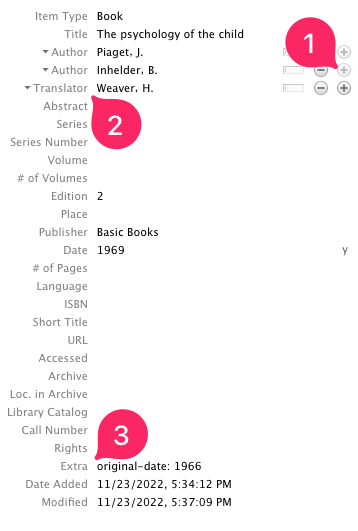
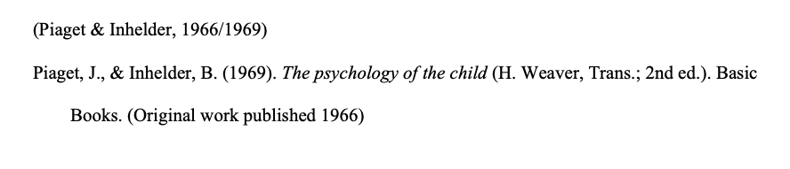

Source: [How to cite a book with its translation](https://forums.zotero.org/discussion/69875/how-to-cite-a-book-with-its-translation)

APA 7ed cite and reference book republished in translation this way:

Piaget, J., & Inhelder, B. (1969). *The psychology of the child* (H. Weaver, Trans.; 2nd ed.). Basic Books. (Original work published 1966)

**Parenthetical citation:** (Piaget & Inhelder, 1966/1969) </br>
**Narrative citation:** Piaget and Inhelder (1966/1969)

To set zotero to give you a citation and reference exactly like these, just take the following steps:

1. After adding the `Author`s, include one more `Author` area, by clicking in the `+`icon (see image)
2. Change the new `Author` to `Translator`, add the translators name.
3. In the `Extra` field, add `original-date: 1982` (put the specific data).
Done.



### This is the citation and reference generated by Zotero





If using another reference style, you might need more fields. You can also add these to the `Extra` field:

``` 
original-title: Type the original title here
original-publisher: Type the original publisher here
original-publisher-place: Type the original place here
original-date: 1982 
```
